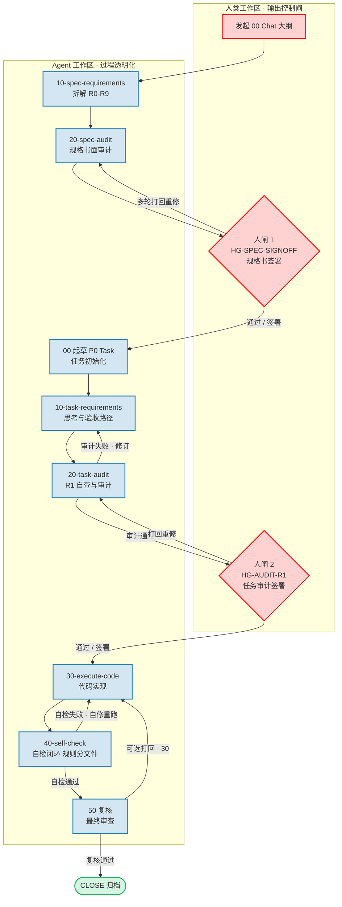

# Harness 标准流程 DAG（V2）

人闸与 Agent 帽的主路径、打回环与 CLOSE。嵌入预览见 [`README.md`](./README.md)。

```mermaid
flowchart TD
    subgraph Human_Lane["人类工作区 · 输出控制闸"]
        H0["发起 00 Chat 大纲"]:::human
        H1{"人闸 1<br/>HG-SPEC-SIGNOFF<br/>规格书签署"}:::human
        H2{"人闸 2<br/>HG-AUDIT-R1<br/>任务审计签署"}:::human
    end

    subgraph Agent_Lane["Agent 工作区 · 过程透明化"]
        A1["10-spec-requirements<br/>拆解 R0-R9"]:::agent
        A2["20-spec-audit<br/>规格书面审计"]:::agent
        A3["00 起草 P0 Task<br/>任务初始化"]:::agent
        A4["10-task-requirements<br/>思考与验收路径"]:::agent
        A5["20-task-audit<br/>R1 自查与审计"]:::agent
        A6["30-execute-code<br/>代码实现"]:::agent
        A7["40-self-check<br/>自检闭环 规则分文件"]:::agent
        A8["50 复核<br/>最终审查"]:::agent
    end

    H0 --> A1
    A1 --> A2
    A2 --> H1
    H1 -->|"通过 / 签署"| A3
    H1 -->|"多轮打回重修"| A2

    A3 --> A4
    A4 --> A5
    A5 -->|"审计失败 · 修订"| A4
    A5 -->|"审计通过"| H2

    H2 -->|"通过 / 签署"| A6
    H2 -->|"打回重修"| A5

    A6 --> A7
    A7 -->|"自检失败 · 自修重跑"| A6
    A7 -->|"自检通过"| A8

    A8 -->|"可选打回 · 30"| A6
    A8 -->|"复核通过"| CLOSE(["CLOSE 归档"]):::endNode

    classDef human fill:#FFD2D2,stroke:#FF0000,stroke-width:2px
    classDef agent fill:#D4E6F1,stroke:#2980B9,stroke-width:2px
    classDef endNode fill:#D5F5E3,stroke:#27AE60,stroke-width:2px
```
